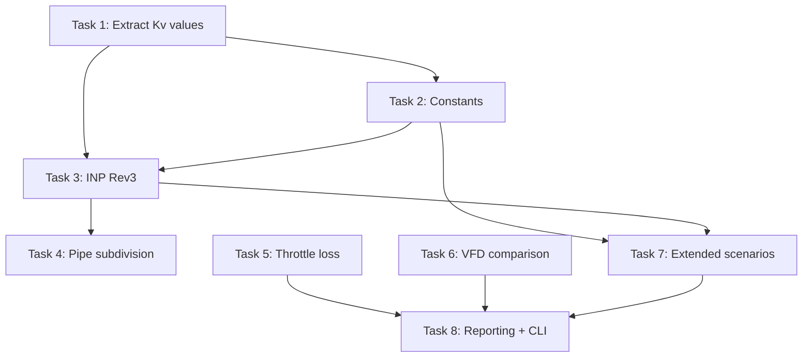

# EPANET Model Optimization — Engineering Tasks

> Each task is self-contained: limited files, independently testable, with explicit acceptance criteria.
> Tasks are ordered by dependency — later tasks may import from earlier ones but never the reverse.

---

## Task 1 — Extract Kv values for intermediate RIKO openings

**Goal:** Read `riko_cylinder_e_dn1800.csv` and extract or interpolate Kv values at φ=26%, 34%, 40%.

| Item | Detail |
|------|--------|
| **Files** | `data/riko_cylinder_e_dn1800.csv` (read-only) |
| **Output** | Printed table: φ, Kv, K_curve = 132.15/Kv² |
| **Deliverable** | Confirmed Kv values to use in all subsequent tasks |

**Acceptance criteria:**
- [ ] Kv values are exact CSV rows (not interpolated) if the CSV has 2% steps
- [ ] `dH = Q² × 132.15 / Kv²` produces physically reasonable headloss (0–20 m range for expected flows)
- [ ] Values are documented with source row reference

---

## Task 2 — Add intermediate RIKO openings to constants

**Goal:** Register 7 total RIKO openings (existing 4 + new φ=26%, 34%, 40%) in the Python codebase.

| Item | Detail |
|------|--------|
| **Files** | [constants.py](file:///home/raul/Documents/rosarito-model_EPANET/rosarito/constants.py) |
| **Test** | [test_core.py](file:///home/raul/Documents/rosarito-model_EPANET/tests/test_core.py) |

**Changes:**
- Add 3 `RikoOpening` entries (φ=26/34/40) to `RIKO_OPENINGS` list
- Add 3 `ReferenceOperatingPoint` entries (hand-calculated via Newton iteration on pump curve vs. system curve)
- Update `RIKO_IDS` to include `RIKO_40`, `RIKO_34`, `RIKO_26`
- Add `RIKO_OPENINGS_EXTENDED` (all 7) alongside existing `RIKO_OPENINGS` (original 4, for backward compat)

**Acceptance criteria:**
- [ ] `RIKO_BY_NPUMPS` unchanged (original 4 mappings preserved)
- [ ] New constant `RIKO_OPENINGS_ALL` contains exactly 7 entries sorted by φ descending
- [ ] `python -m unittest discover tests -v` passes — existing tests untouched, new coverage tests added for 7 openings
- [ ] Each new `ReferenceOperatingPoint` has: Q_total, Q/pump, H_pump, dH_RIKO hand-calculated to ±0.5%

---

## Task 3 — Create INP Rev3 with intermediate GPV curves

**Goal:** Produce `ROSARITO_EPANET_Rev3.inp` with all 7 RIKO openings modeled as parallel GPVs.

| Item | Detail |
|------|--------|
| **Files** | [ROSARITO_EPANET_Rev3.inp](file:///home/raul/Documents/rosarito-model_EPANET/inp_files/ROSARITO_EPANET_Rev3.inp) (NEW) |
| **Source** | Copy from `ROSARITO_EPANET_Rev2.inp`, then add sections |

**Changes to INP:**
1. `[TITLE]` — update revision to Rev3 with date and changelog
2. `[CURVES]` — add `RIKO_40pct`, `RIKO_34pct`, `RIKO_26pct` (7 points each, Kv-based)
3. `[VALVES]` — add 3 GPV links (RIKO_40, RIKO_34, RIKO_26), initial CLOSED
4. `[STATUS]` — add 3 new valves as CLOSED
5. `[RULES]` — add rules for intermediate openings (triggered by conditions TBD per Task 1 analysis)
6. `[VERTICES]` / `[LABELS]` — add GUI display for new valve links
7. `[COORDINATES]` — unchanged

**Acceptance criteria:**
- [ ] EPANET 2.2 CLI loads the file without parse errors
- [ ] Steady-state with original 4-pump config (RIKO_44 OPEN) produces same Q, H, dH as Rev2 (±0.1%)
- [ ] Each new GPV curve produces correct dH at its expected balanced flow (matches hand calc ±1%)
- [ ] Only ONE GPV is ever OPEN at any timestep (rules enforce mutual exclusion)

---

## Task 4 — Subdivide P_DS for transient readiness

**Goal:** Split the 303m GRP pipe into 4 equal segments with 3 intermediate junctions.

| Item | Detail |
|------|--------|
| **Files** | `ROSARITO_EPANET_Rev3.inp` (modify, after Task 3) |
|  | [constants.py](file:///home/raul/Documents/rosarito-model_EPANET/rosarito/constants.py) — add junction/pipe IDs |

**Changes:**
- Replace `P_DS` with `P_DS_1`, `P_DS_2`, `P_DS_3`, `P_DS_4` (L=75.75m each, same DN/ε)
- Add `J_DS_1`, `J_DS_2`, `J_DS_3` at elevation 0m
- Update `PIPE_IDS` in constants (add alias for backward compat)

**Acceptance criteria:**
- [ ] Total friction loss across 4 segments equals single-pipe loss within ±0.01 m at design flow
- [ ] Head at J_RIKO_OUT and PLANT unchanged (±0.01 m)
- [ ] All existing staging scenarios unchanged (±0.1% on Q_total)
- [ ] EPANET report shows intermediate node pressures along P_DS

---

## Task 5 — Throttling loss quantification module

**Goal:** Compute the power wasted across the RIKO valve at each operating point.

| Item | Detail |
|------|--------|
| **Files** | [energy.py](file:///home/raul/Documents/rosarito-model_EPANET/rosarito/energy.py) — add function |
|  | [test_core.py](file:///home/raul/Documents/rosarito-model_EPANET/tests/test_core.py) — add tests |

**New function:**
```python
def compute_throttle_loss(q_total_lps: float, dh_riko_m: float) -> ThrottleLoss:
    """P_throttle = ρ × g × Q(m³/s) × ΔH_RIKO / 1000 [kW]"""
```

**Acceptance criteria:**
- [ ] At design point (Q=5017 l/s, dH=7.52 m): P_throttle ≈ 75.7 kW (ρ=1025, g=9.81)
- [ ] At 1-pump (Q=1043 l/s, dH=14.23 m): P_throttle ≈ 149.3 kW
- [ ] Daily energy waste (kWh) = P_throttle × 24 for each scenario
- [ ] Unit test validates against hand-calculated value at design point (±0.5%)

---

## Task 6 — VFD comparison module

**Goal:** Compute the theoretical pump speed (affinity laws) that eliminates RIKO throttling loss.

| Item | Detail |
|------|--------|
| **Files** | [optimization.py](file:///home/raul/Documents/rosarito-model_EPANET/rosarito/optimization.py) (NEW) |
|  | [test_optimization.py](file:///home/raul/Documents/rosarito-model_EPANET/tests/test_optimization.py) (NEW) |

**Core logic:**
```
Without RIKO: H_required = H_PLANT + hf_pipes (at Q_target)
Affinity law: H = H_rated × (N/N_rated)²,  Q = Q_rated × (N/N_rated)
Find N/N_rated such that pump delivers exactly H_required at Q_target
```

**Acceptance criteria:**
- [ ] At 4-pump design: speed ratio < 1.0 (pump is overpowered, throttling wastes energy)
- [ ] Power saving = (P_shaft_throttled − P_shaft_vfd) is positive for all scenarios
- [ ] At 4-pump: saving ≈ 75–80 kW (matches throttle loss from Task 5)
- [ ] Speed ratio never drops below 0.7 (practical VFD limit)
- [ ] Unit tests validate affinity-law calculations at 2 known operating points

---

## Task 7 — Extended staging scenarios runner

**Goal:** Run all 7 RIKO openings as steady-state scenarios using EPyT.

| Item | Detail |
|------|--------|
| **Files** | [scenarios.py](file:///home/raul/Documents/rosarito-model_EPANET/rosarito/scenarios.py) |

**New function:**
```python
def run_staging_scenarios_extended(inp_path=None) -> list[SteadyStateResult]:
    """Run all 7 staging scenarios (4-pump down to mixed intermediate)."""
```

**Acceptance criteria:**
- [ ] Returns 7 `SteadyStateResult` objects
- [ ] Original 4 results match `run_staging_scenarios()` output exactly
- [ ] New 3 results have Q_total between their neighboring original scenarios
- [ ] All Q/pump > 845 l/s (min stable flow)
- [ ] EPANET solver converges without warnings for all 7 scenarios

---

## Task 8 — Reporting and CLI integration

**Goal:** Add console output and CLI commands for new analyses.

| Item | Detail |
|------|--------|
| **Files** | [reporting.py](file:///home/raul/Documents/rosarito-model_EPANET/rosarito/reporting.py) |
|  | [main.py](file:///home/raul/Documents/rosarito-model_EPANET/main.py) |

**New CLI commands:**
- `python main.py optimize` — throttling analysis + VFD comparison table
- `python main.py staging-extended` — all 7 scenarios with validation

**New report functions:**
- `print_throttling_analysis(results)` — table: φ, Q, ΔH_RIKO, P_throttle, daily_kWh
- `print_vfd_comparison(results)` — table: scenario, P_throttled, P_vfd, saving_kW, saving_%

**Acceptance criteria:**
- [ ] `python main.py optimize` runs without error and prints both tables
- [ ] `python main.py staging-extended` prints 7-row staging table + validation
- [ ] All existing CLI commands (`staging`, `energy`, `eps`, `report`) unchanged
- [ ] Tables are well-formatted with aligned columns and engineering units

---

## Task Dependency Graph



> [!NOTE]
> Tasks 5 and 6 are independent of Tasks 3–4 and can proceed in parallel once Task 2 is complete.
